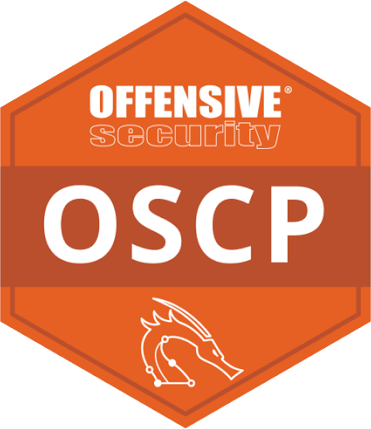
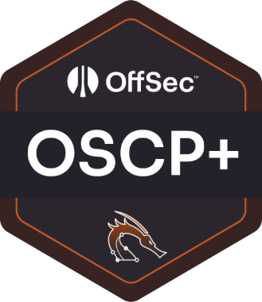
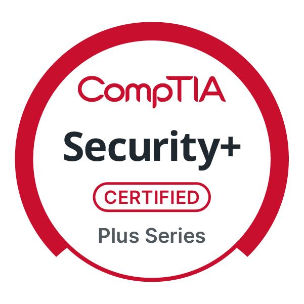
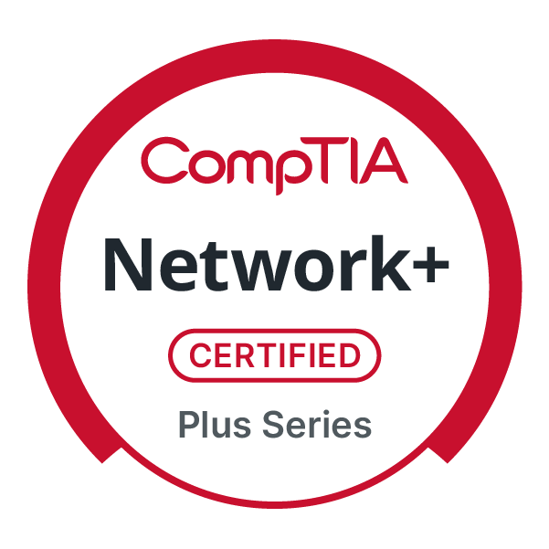
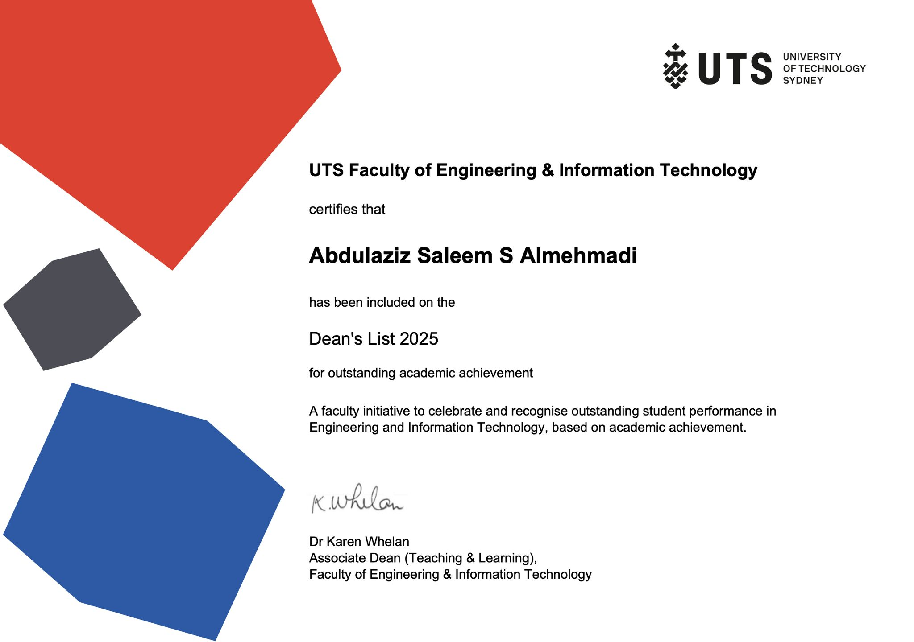
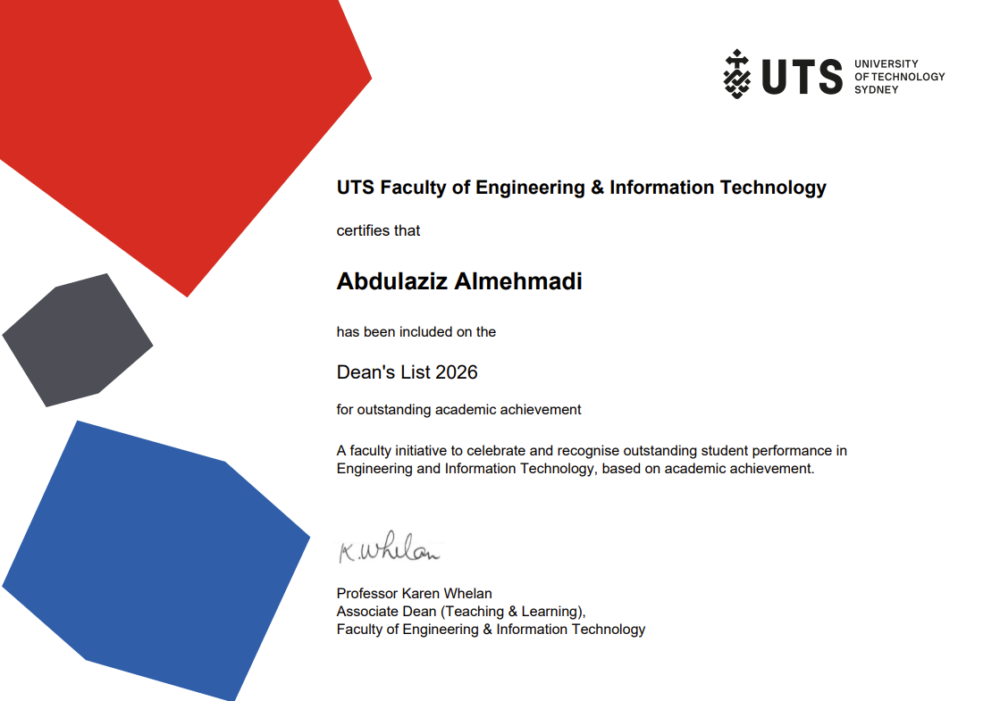

# Abdulaziz Almehmadi

**Penetration Tester @ [Siege Cyber](https://www.siegecyber.com.au) · Cybersecurity Student @ UTS**

*OSCP+ certified offensive security professional specialising in network, web application, and Active Directory penetration testing.*

---

## 👨‍💻 About Me

- 🔐 Penetration Tester at **Siege Cyber**, conducting external and internal engagements across networks, web applications, Microsoft 365, and Active Directory environments
- 🎓 Final-year **Bachelor of Cybersecurity** student at the University of Technology Sydney — **GPA 6.75/7**, Dean's List **2025 & 2026**
- 🚩 Hands-on offensive security: **204 flags** captured across OffSec labs and **40 Hack The Box** machines completed
- 📍 Based in Sydney, Australia · Bilingual in **English & Arabic**

## 📜 Certifications

  &nbsp;&nbsp;
  &nbsp;&nbsp;
  &nbsp;&nbsp;
  

  &nbsp;&nbsp;
  

| Certification / Award | Issuer | Issued |
| --- | --- | --- |
| Dean's List 2026 | UTS Faculty of Engineering & IT | Jul 2026 |
| OSCP+ | OffSec | Dec 2025 |
| Offensive Security Certified Professional (OSCP) | OffSec | Dec 2025 |
| Dean's List 2025 | UTS Faculty of Engineering & IT | Jun 2025 |
| Security+ | CompTIA | Oct 2024 |
| Network+ | CompTIA | Jul 2024 |

## 🎯 What I Do

- **External & internal penetration testing** — networks, web applications, Microsoft 365, and Active Directory environments
- **Reconnaissance & exploitation** — vulnerability assessment, privilege escalation, and post-exploitation
- **Security reporting** — clear, actionable findings with remediation guidance for technical and executive audiences

## 📊 Offensive Security Stats

|                                    |                                                                         |
| ---------------------------------- | ----------------------------------------------------------------------- |
| 🚩 OffSec lab flags captured       | **204**                                                                 |
| 📦 Hack The Box machines completed | **40** — [HTB Profile](https://app.hackthebox.com/public/users/1865066) |

## 🛠️ Tools & Skills

**Offensive tooling**

**Scripting & platforms**

## 🎤 Conferences & Community

| Event / Organisation | Date |
| --- | --- |
| UTS Cyber Security Society — Member | Feb 2024 – Present |
| CSECcon III | Oct 2024 |
| BSides Canberra | Sep 2024 |
| CrikeyCon Brisbane | Mar 2024 |

## 📫 Connect

---

💡 Check out my pinned repositories below for university coursework, HTB writeups, and security research.

